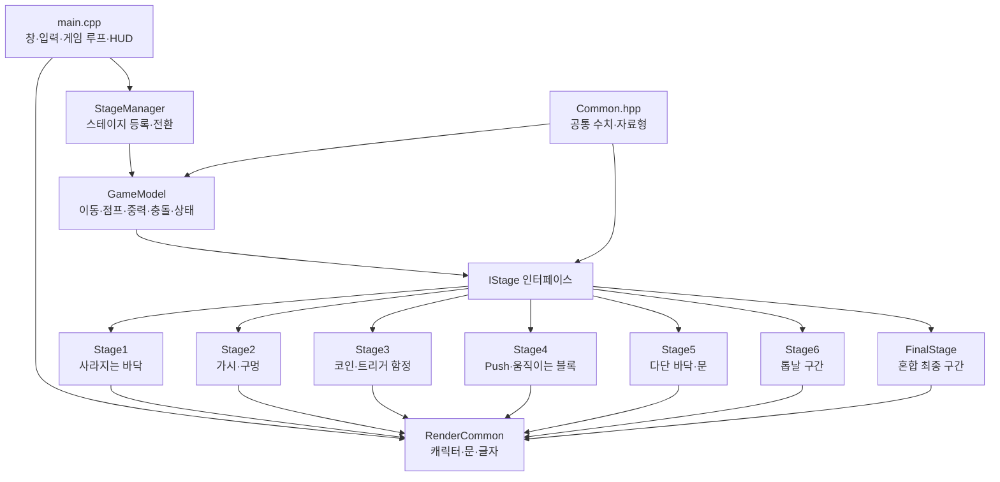

# Level Devil 프로젝트 구조 정리

## 1. 프로젝트 개요

| 항목 | 내용 |
| --- | --- |
| 프로젝트 | Level Devil 모작 팀 프로젝트 |
| 언어 | C++17 |
| 그래픽 라이브러리 | SFML 3.1.0 |
| 대상 환경 | Windows x64 / Visual Studio 2026 |
| 내부 해상도 | 960 × 540 |
| 물리 갱신 주기 | 1/120초 고정 |
| 현재 플레이 순서 | Stage1 → Stage2 → Stage3 → Stage4 → Stage5 → Stage6 → FinalStage |
| 전체 스테이지 수 | 7개 |
| 사운드 | 구현 범위에서 제외 |

현재 저장소에는 팀의 Stage1~Stage6와 보너스 FinalStage가 모두 병합되어 있습니다.

## 2. 폴더 구조

```text
LevelDevil/
├─ src/
│  ├─ Common.hpp                 공통 상수와 자료형
│  ├─ IStage.hpp                 모든 스테이지의 공통 인터페이스
│  ├─ GameModel.hpp/.cpp         플레이어 물리와 게임 상태
│  ├─ RenderCommon.hpp/.cpp      공통 캐릭터·문·글자 렌더링
│  ├─ StageManager.hpp/.cpp      스테이지 등록과 순차 전환
│  ├─ Stage1.hpp/.cpp            1-1형 사라지는 바닥
│  ├─ Stage2.hpp/.cpp            이동 가시와 연속 구멍
│  ├─ Stage3*.hpp/.cpp           코인 트리거 기반 복합 기믹
│  ├─ Stage4.hpp/.cpp            이동·상승·낙하 블록
│  ├─ Stage5.hpp/.cpp            다단 바닥 함정과 이동 문
│  ├─ Stage6.hpp/.cpp            아래에서 위로 올라가는 톱날 스테이지
│  ├─ FinalStage.hpp/.cpp        2층 구조의 혼합 최종 스테이지
│  └─ main.cpp                   창, 입력, 게임 루프, HUD, 엔딩
├─ tests/
│  ├─ GameModelTests.cpp         물리·기믹·통과 경로 자동 검사
│  └─ GameModelTests.vcxproj
├─ artifacts/                    화면 및 상태 검증 결과
├─ external/SFML-3.1.0/          로컬 SFML 의존성
├─ bin/Debug, bin/Release/       실행 파일
├─ LevelDevil.slnx               Visual Studio 솔루션
├─ LevelDevil.vcxproj            메인 프로젝트 설정
├─ Build.ps1 / Build.cmd         의존성 확인, 빌드, 테스트
├─ Play.cmd                      Release 실행
├─ README.md                     실행 및 구현 설명
└─ STAGE_GUIDE.md                팀원별 파일 소유와 병합 규칙
```

## 3. 전체 구조



핵심 설계는 플레이어 물리와 맵 기믹을 분리한 것입니다. `GameModel`은 모든 방에서 같은 움직임을 제공하고, 각 `StageX`는 자기 지형과 함정만 관리합니다.

## 4. 공통 모듈 역할

| 모듈 | 주요 역할 |
| --- | --- |
| `Common.hpp` | 화면 크기, 이동 속도, 중력, 점프력, 충돌 사각형, 입력, 플레이어 상태 정의 |
| `IStage.hpp` | 스폰, 초기화, 업데이트, 고체 지형, 위험 판정, 출구 판정, 그리기 함수 규격 정의 |
| `GameModel` | 좌우 이동, 점프, 중력, 벽·바닥·천장 충돌, 낙사, 사망, 재시작, 문 진입 처리 |
| `RenderCommon` | 공통 문, 픽셀 캐릭터, 걷기·점프 자세, 비트맵 글자 렌더링 |
| `StageManager` | 스테이지 객체 보관, 현재 방 선택, 클리어 후 다음 방 전환, 전체 재시작 |
| `main.cpp` | SFML 창 생성, 키·마우스 입력, 고정 시간 게임 루프, HUD, 일시정지, 최종 엔딩 |

### 게임 상태

```text
Playing → Dying → Playing
Playing → EnteringDoor → Cleared → 다음 스테이지
마지막 Cleared → 최종 엔딩 → 전체 재시작
```

- `Playing`: 일반 플레이
- `Dying`: 함정 접촉 또는 낙사 후 약 0.38초 대기
- `EnteringDoor`: 문에 닿으면 자동으로 문 안쪽으로 이동하며 축소
- `Cleared`: 현재 방 클리어 또는 최종 엔딩 표시

## 5. 한 프레임의 처리 흐름


SFML 화면 주사율과 관계없이 물리는 1/120초 간격으로 계산하여 이동과 함정 타이밍을 일정하게 유지합니다.

## 6. 스테이지별 구조

| 클래스 | 참고 구간 | 핵심 기믹 | 주요 상태 |
| --- | --- | --- | --- |
| `Stage1` | 원작 1-1형 | 문 앞 바닥이 열려 구멍 생성 | 구멍 발동 여부·경과 시간 |
| `Stage2` | 가시 구간 | 접근 시 이동하는 가시와 연속으로 열리는 구멍 | 가시·구멍별 발동 여부와 애니메이션 시간 |
| `Stage3` | 코인 구간 | 코인에 연결된 사라지는 바닥·이동 벽·낙하 천장과 위치 감지 함정 | 코인 수집과 각 트리거 대상 상태 |
| `Stage4` | Push 구간 | 플레이어를 미는 벽, 상승 벽, 낙하 블록, 문 앞 구멍 | 각 블록의 이동 상태와 구멍 개방 상태 |
| `Stage5` | 다단 함정 구간 | 연속 바닥 함정, 상승 바닥·계단·기둥, 이동 문과 가짜 문 | 3개 진행 페이즈와 함정·문 상태 |
| `Stage6` | Saws 구간 응용 | 추격 톱날, 3개 붕괴 발판, 단방향 윗면을 가진 상승 톱날 3개 | 추격 톱날 모드·탈출 시간·톱날 상승률 |
| `FinalStage` | 최종 혼합 구간 | 위층 추격 벽·낙하 바닥·시간제 Push 벽·가시, 교차 벽 톱날 낙하, 아래층 부분 노출 상승 톱날·구멍·발사체 | 층 이동 여부·각 함정 발동 상태·톱날/발사체 상태 |

### Stage1 진행

```text
출발 → 문 방향 이동 → 문 앞 바닥 개방 → 점프로 구멍 회피 → 문 자동 진입
```

### Stage6 진행

```text
왼쪽 아래 시작 절벽 → 뒤에서 톱날 추격
→ 임시 발판 3개가 순서대로 붕괴
→ 다음 톱날이 다 올라오기를 기다리며 단방향 윗면 3개를 연속 점프
→ 오른쪽 위 발판 → 문 자동 진입
```

### FinalStage 진행

```text
왼쪽 위 시작 → 추격 벽을 피해 낙하 바닥 발동
→ 구덩이 반대편의 Push 벽이 내려간 뒤 점프 → 가시 통과
→ 오른쪽 세로 통로로 낙하하며 교차 벽 톱날 3개 회피
→ 아래층에서 솟는 톱날 → 열리는 구멍 → 발사체
→ 왼쪽 문 → 7 / 7 엔딩
```

Stage6와 FinalStage는 스테이지별 천장 경계를 사용해 960 × 540 화면의 세로 공간을 활용합니다. 톱날과 함정은 각 방의 갈색 배경 팔레트에서 더 어두운 색을 사용합니다.

## 7. 스테이지 확장 방식

새 스테이지 담당자는 `StageX.hpp`와 `StageX.cpp`만 작성합니다.

`IStage`에서 요구하는 항목:

1. `label()` — 스테이지 이름
2. `spawnPoint()` — 시작 좌표
3. `ceilingY()` — 스테이지별 화면 위쪽 이동 경계
4. `reset()` — 함정 상태 초기화
5. `update()` — 플레이어 위치에 따른 기믹 갱신
6. `solids()` — 현재 충돌 가능한 지형
7. `touchesHazard()` — 가시·톱날 등의 사망 판정
8. `isAtGoal()` / `goalPoint()` — 문 진입 판정과 도착 위치
9. `draw()` — 지형·함정·문 그리기

완성된 스테이지는 공통 담당자가 `StageManager.cpp`, Visual Studio 프로젝트 파일, 테스트 프로젝트에 등록합니다.

## 8. 현재 코드 규모

| 구분 | 파일 | 줄 수 |
| --- | --- | ---: |
| 공통 자료형·인터페이스 | `Common.hpp`, `IStage.hpp` | 114 |
| 공통 물리 | `GameModel.hpp/.cpp` | 253 |
| 공통 렌더링 | `RenderCommon.hpp/.cpp` | 209 |
| 스테이지 관리 | `StageManager.hpp/.cpp` | 117 |
| Stage1 | `Stage1.hpp/.cpp` | 145 |
| Stage2 | `Stage2.hpp/.cpp` | 368 |
| Stage3 | `Stage3*.hpp/.cpp` | 699 |
| Stage4 | `Stage4.hpp/.cpp` | 535 |
| Stage5 | `Stage5.hpp/.cpp` | 1309 |
| Stage6 | `Stage6.hpp/.cpp` | 392 |
| FinalStage | `FinalStage.hpp/.cpp` | 647 |
| 실행·HUD·검증 렌더러 | `main.cpp` | 642 |
| 자동 검사 | `GameModelTests.cpp` | 1421 |

줄 수는 공백과 주석을 포함한 현재 파일 기준입니다.

## 9. 빌드와 검증

```powershell
.\Build.ps1 -Configuration Debug
.\Build.ps1 -Configuration Release
```

현재 검증 결과:

- Debug/Release x64 빌드 성공
- 자동 검사 620개 통과
- Stage1~Stage6와 FinalStage 등록·첫 순차 전환 검증 통과
- Stage1 낙사·재시작·점프·문 진입 검증 통과
- Stage2~Stage5 사망 0회 연속 통과 경로 검증
- Stage6 기믹 상태와 사망 0회 통과 경로 검증
- FinalStage 위층·낙하 통로·아래층을 잇는 사망 0회 통과 경로 검증
- 960 × 540 오프스크린 렌더링과 최종 `7 / 7` 엔딩 검증

검증 화면:

| 화면 | 파일 |
| --- | --- |
| Stage1 구멍 발동 | `artifacts/verification/02-trap.png` |
| Stage6 전체 경로 | `artifacts/stage6-ascent-verification/05-route-ready.png` |
| FinalStage Push 벽 | `artifacts/final-two-level-verification/03-push-wall-trap.png` |
| FinalStage 낙하 통로 | `artifacts/final-two-level-verification/05-wall-saw-descent.png` |
| FinalStage 상승 톱날 | `artifacts/final-two-level-verification/06-rising-floor-saw.png` |
| 최종 엔딩 | `artifacts/final-two-level-verification/09-ending.png` |

## 10. PPT 권장 구성

1. **프로젝트 소개** — 목표, C++17, SFML 3.1.0, 960×540
2. **폴더 및 클래스 구조** — 전체 구조 Mermaid 그림 사용
3. **공통 시스템** — `GameModel`, `IStage`, `StageManager` 역할
4. **스테이지 구현** — Stage1, Stage6, FinalStage 비교표와 검증 화면
5. **실행 흐름** — 입력부터 충돌·함정·렌더링까지의 프레임 흐름
6. **팀 협업 방식** — 공통 코드와 `StageX.hpp/.cpp` 소유 범위
7. **검증 결과** — Debug/Release 빌드, 620개 검사, 무사망 통과 경로
8. **향후 작업** — 전체 난이도 조정과 7개 스테이지 연속 플레이 검증

발표에서는 코드 전체보다 `IStage`를 이용한 역할 분리와 스테이지별 상태 변화 방식을 핵심 설계로 설명하는 것이 좋습니다.
